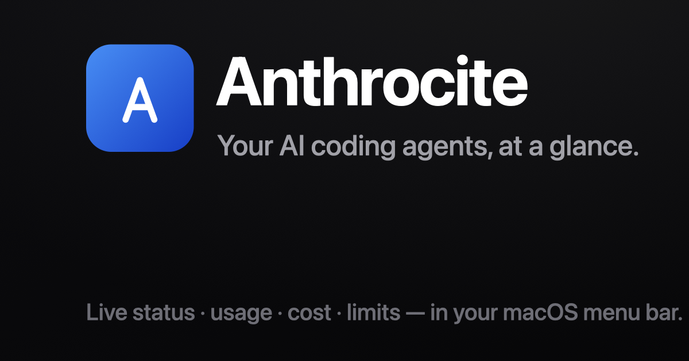

<p align="center">
  
</p>

<h1 align="center">Anthrocite</h1>

<p align="center">
  Usage &amp; status for your AI coding agents — in your macOS menu bar.<br />
  <strong>Free &amp; open source · macOS 15+ · MIT licensed</strong>
</p>

---

Monorepo (Turborepo + pnpm) with the macOS app, the marketing site, and a small
licensing/API service.

## Structure

```
apps/
  macos/   Native macOS menu-bar app + dashboard (SwiftUI + AppKit, Xcode)
  web/     Landing page (Vite + React + Tailwind + Framer Motion)
  api/     Small service (Hono)
packages/  Shared code (TBD)
```

## Develop

```sh
pnpm install      # install JS workspaces
pnpm web          # run the landing page (Vite dev server)
pnpm api          # run the API (Hono)
pnpm build        # turbo build all JS apps
```

The macOS app builds with Xcode:

```sh
xcodebuild -project apps/macos/ClaudeTracker.xcodeproj \
  -scheme ClaudeTracker -configuration Release build
```

## The app

- **Live status** — what the agent is doing right now (Reading/Running/…); a
  timer in the menu bar.
- **Multi-session** — every concurrent session (CLI, VS Code, JetBrains) with
  per-project status + context.
- **Real limits** — 5-hour & weekly used % and exact resets.
- **Exact cost** — per-model pricing (LiteLLM); the current session uses the
  CLI's own reported cost.
- **Dashboard** — native Swift Charts trends, projects & models.

Everything is read locally from `~/.claude/projects/**/*.jsonl` and a per-session
status bridge (`apps/macos/scripts/anthrocite-statusline.sh`) — nothing leaves
your machine.

## License

[MIT](LICENSE) © 2026 Marques Scripps.
